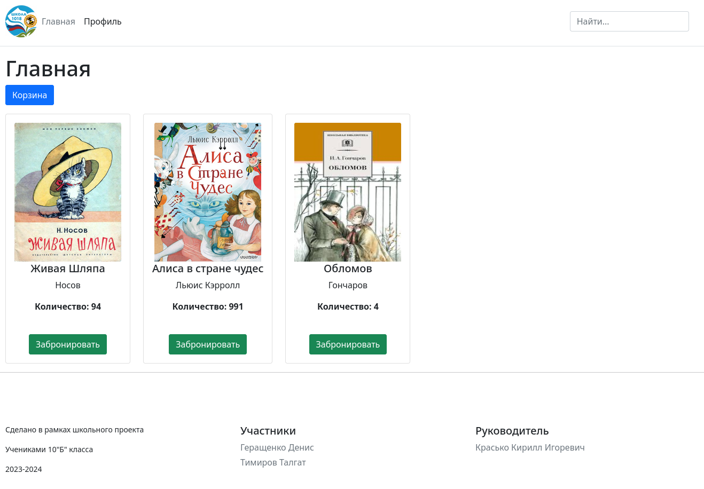
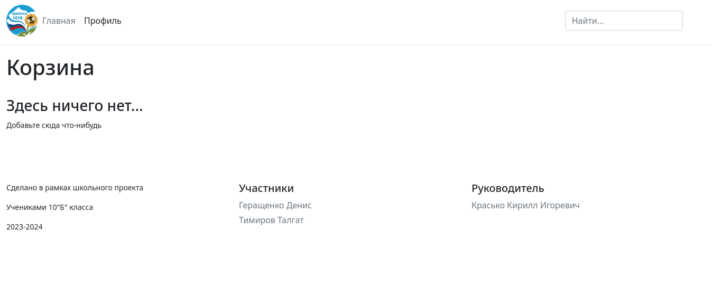
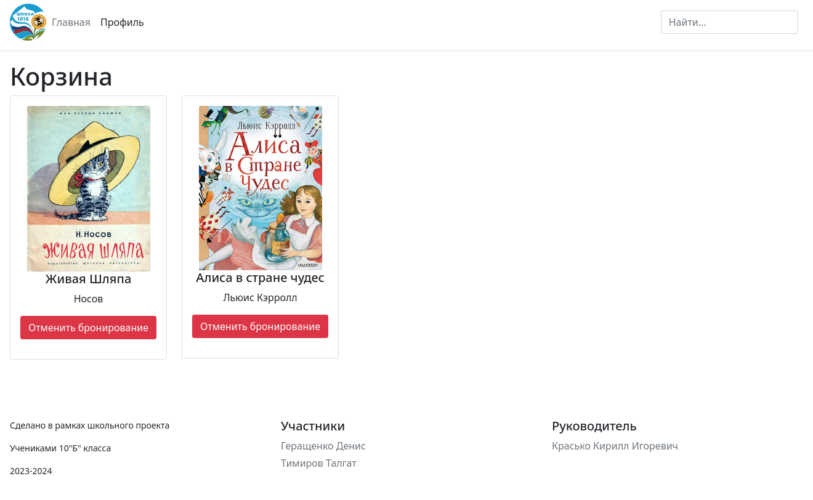
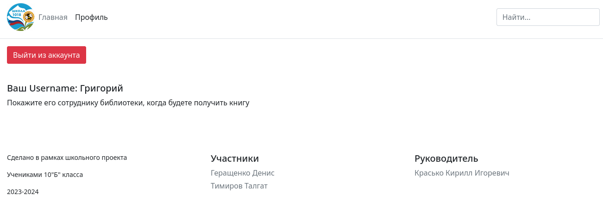
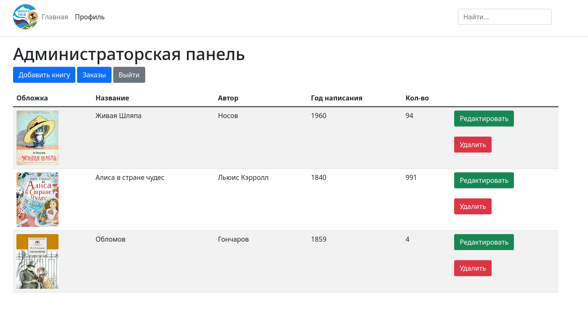
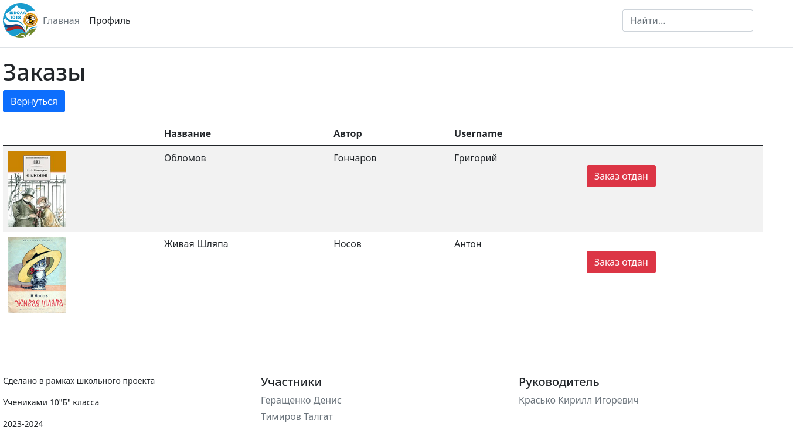

# Система бронирования книг для школьной библиотеки

Это макет веб приложения, позволяющего пользователям бронировать книги

# Оглавление
1. [Задачи](#title1)
   - [Что реализовано](#title1.1)
   - [Что планируется реализовать](#title1.2)
2. [Как установить](#title2)
3. [Как запустить](#title3)
4. [Скриншоты](#title4)

## <a id="title1">Задачи</a>
### <a id="title1.1">Что реализовано</a>
- регистрация/вход в аккаунт
- отображение книг библиотеки
- возможномть бронирования книг
- корзина с заказами
- страница профиля
- панель администратора
- занесение/удаление, администратором, книг в базу данных

### <a title="title1.2">Что планируется реализовать</a>
- Возможность редактирования книг администратором
- Список заказов в админимстраторской панели
- страница входа в администраторский аккаунт

## <a title="title2">Как установить</a>
1. Прверьте наличие на вашем устройстве Python, PIP, Git.
2. Скачайте репозиторий `git clone https://github.com/DenuG/schoollibrary.git`
3. В папке пректа запустите команду `pip install requirements.txt`
4. Если IDE жалуется на bcrypt, то поробуйте скачать более раннюю версию 3.2 `pip install bcrypt==3.2.0`

## <a title="title3">Как запустить</a>
1. Проверьте все ли у вас установленно
2. Запустите файл main.py и перейдите по ссылке которую вывел в консоль

## <a id="title4">Скриншоты</a>

# Хорошего денечка и спасибо за внимание!
